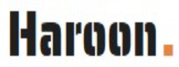
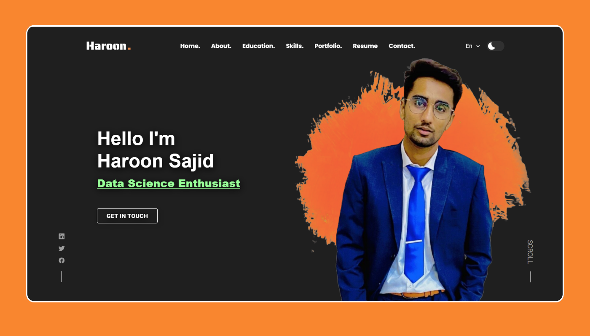

<div align="center">
  
 
  <br />
  
  

  <h2 align="center">Haroon - Personal portfolio</h2>

  This website is fully responsive personal portfolio, <br />Responsive for all devices, built using HTML, CSS, and JavaScript.

  <a href="https://haroon-sajid.github.io/portfolio/"><strong>➥ Live Demo</strong></a>

</div>

<br />

### Demo Screeshots




### Run Locally

To run **haroon-portfolio** locally, run this command on your git bash:

Linux and macOS:

```bash
sudo git clone https://github.com/haroon-sajid/portfolio.git
```

Windows:

```bash
git clone https://github.com/haroon-sajid/portfolio.git
```

### Contact

[Linkedin](https://www.linkedin.com/in/haroon-sajid).


